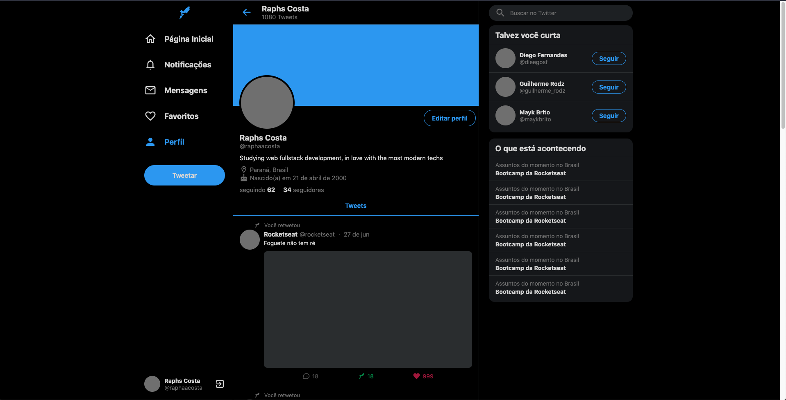
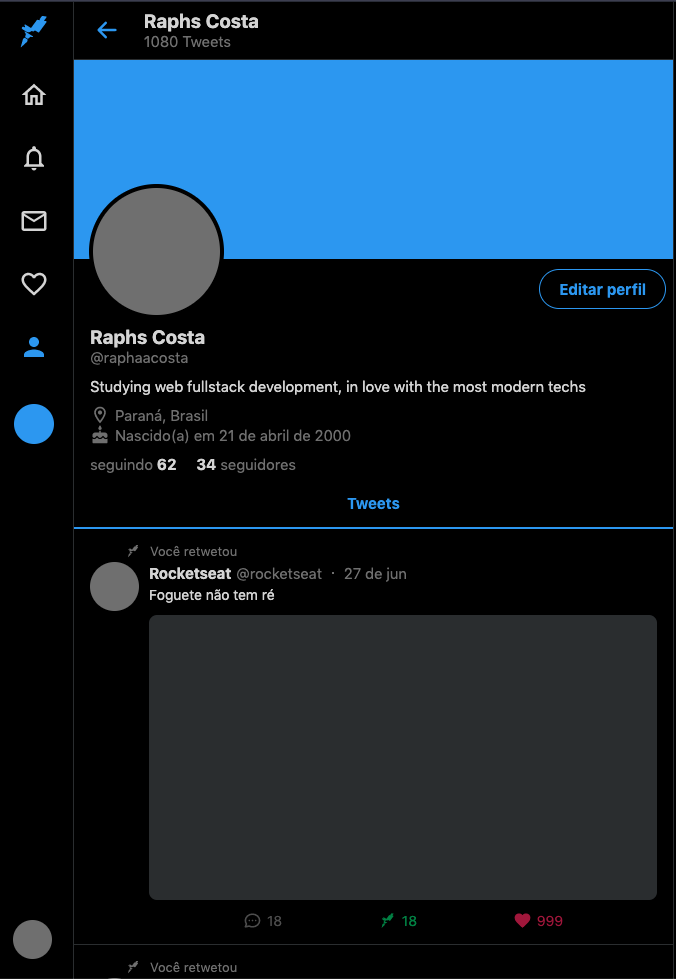
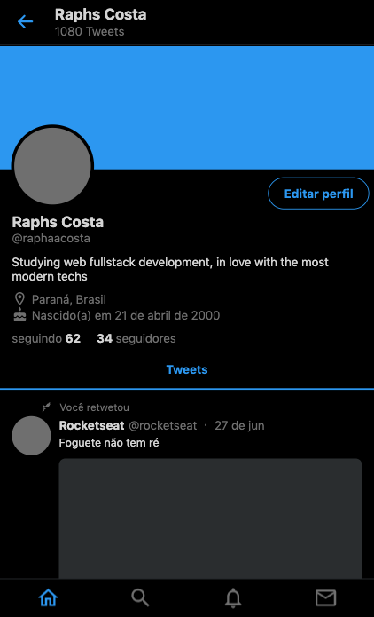

<h1 align="center">
  Twitter UI Clone Responsively
</h1>

<a target="_blank" href="https://unruffled-hoover-63c484.netlify.app/">Deploy</a>

  
  

# Results

## Web Mode
  

    
  

## Tablet Mode
  

    
  

## Mobile Mode
  

    
  

# About this project

> This is just a partial clone of the Twitter UI, made for the purpose of practicing
> front-end development responsively.

# Techs

 - React.js
 - Typescript
 - Styled Components

# Usage

  To run this project in your machine, clone this repository: 
  - Run `npm install` or `yarn install`.
  - Run `npm run start` or `yarn start` and access `https://localhost:3000`.
